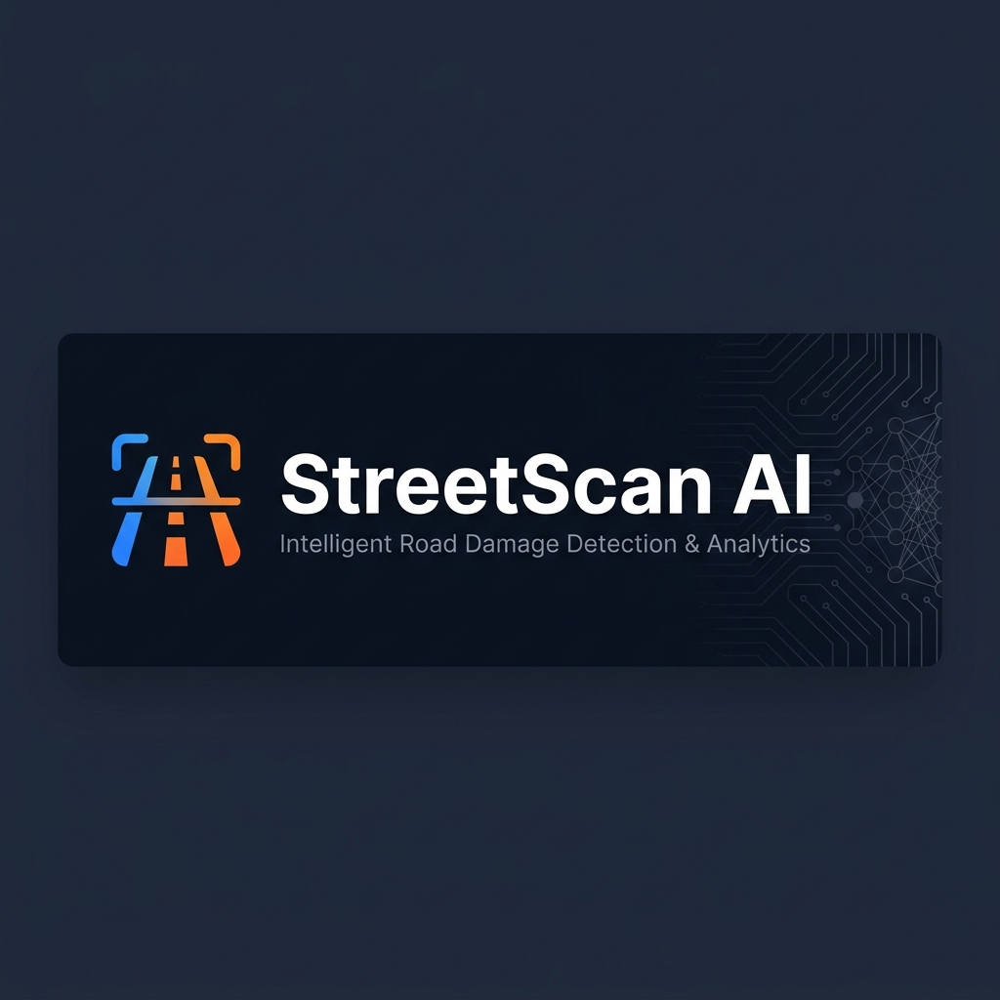
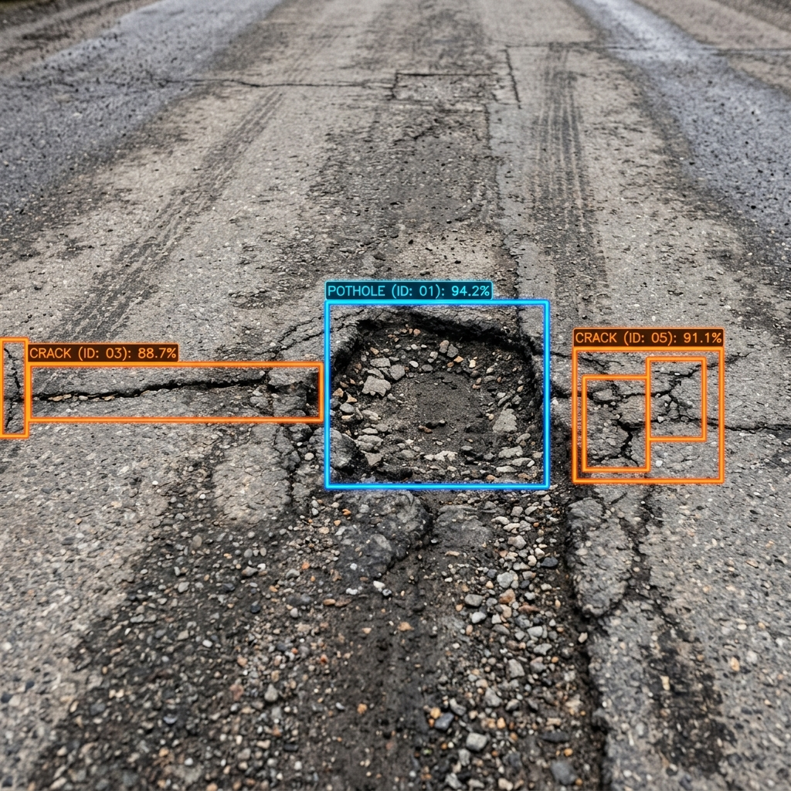
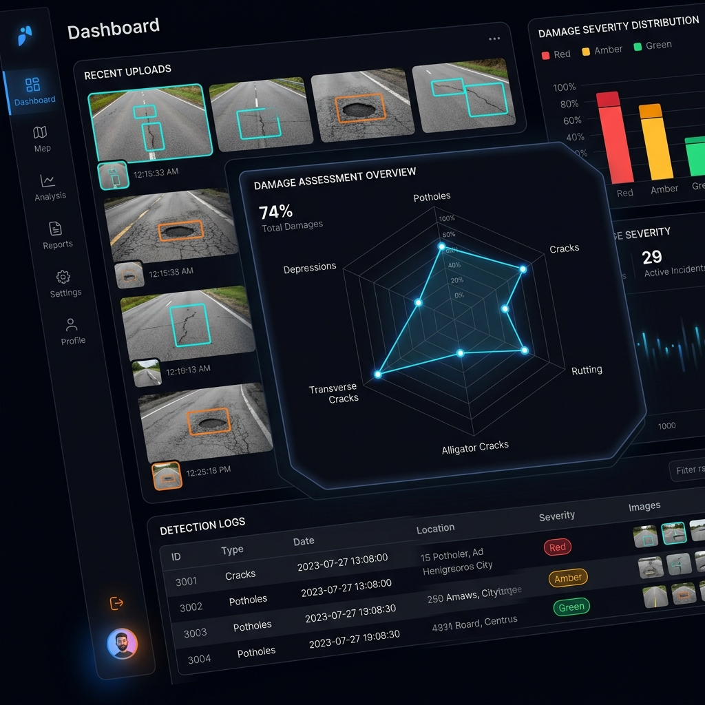

<div align="center">



<br />

**AI-powered road damage detection system using YOLOv8 computer vision with a full-stack analytics dashboard, real-time monitoring, and automated PDF reporting.**

<br />

[](#)
[](#tech-stack)
[](#tech-stack)
[](#tech-stack)
[](#tech-stack)
[](#tech-stack)
[](#tech-stack)
[](#license)

<br />

[View Demo](#screenshots) · [Getting Started](#getting-started) · [API Reference](#api-reference) · [Architecture](#architecture)

</div>

<br />

---

<br />

## About

**StreetScan AI** is a production-grade road damage detection platform that combines deep learning with a modern analytics dashboard. Upload road images or driving footage, and the system automatically identifies structural defects — potholes, alligator cracks, transverse cracks, and longitudinal cracks — with bounding-box overlays, severity classification, and confidence scoring.

Built for municipal road inspectors, civil engineers, and urban planning teams, the platform transforms raw road media into actionable intelligence with professional PDF reports, GPS-tagged detection logs, and real-time radar analytics.

<br />

### Key Capabilities

<table>
<tr>
<td width="50%">

**Detection & Analysis**
- Frame-by-frame video analysis with timeline markers
- YOLOv8 deep learning with OpenCV contour fallback
- 4 damage classes: D00, D10, D20, D40
- Real-time confidence scoring & severity ranking

</td>
<td width="50%">

**Reporting & Storage**
- Professional branded PDF reports with severity gauges
- AWS S3 cloud storage for media & annotated images
- Historical report registry with advanced filtering
- GPS-tagged detections with heatmap visualization

</td>
</tr>
</table>

<br />

---

<br />

## Screenshots

<div align="center">

<table>
<tr>
<td align="center" width="50%">
<strong>AI Detection — YOLOv8 Bounding Boxes</strong>
<br /><br />

</td>
<td align="center" width="50%">
<strong>Analytics Dashboard — Mission Control</strong>
<br /><br />

</td>
</tr>
</table>

<br />


<em>Aerial road analysis with real-time AI damage classification overlays</em>

</div>

<br />

---

<br />

## Architecture

The system follows a three-tier client-server architecture with a React frontend, FastAPI backend, and a hybrid AI detection service.

```
┌─────────────────────────────────────────────────────────────────────┐
│                        PRESENTATION LAYER                          │
│                                                                     │
│   React 19 + Vite SPA     Tailwind CSS     Recharts Analytics      │
│   ┌──────────────┐    ┌──────────────┐    ┌──────────────┐         │
│   │  Dashboard   │    │  Live Map    │    │  Reports     │         │
│   │  Monitor     │    │  Heatmap     │    │  Analytics   │         │
│   └──────┬───────┘    └──────┬───────┘    └──────┬───────┘         │
│          └───────────────────┴───────────────────┘                  │
│                              │ HTTP / JSON                          │
├──────────────────────────────┼──────────────────────────────────────┤
│                        APPLICATION LAYER                            │
│                              │                                      │
│   FastAPI Router ───── Schema Validation (Pydantic)                │
│          │                                                          │
│   ┌──────┴───────┐    ┌──────────────┐    ┌──────────────┐         │
│   │  AI Service  │    │  S3 Service  │    │  PDF Service │         │
│   │  YOLOv8+CV2  │    │  Boto3 / FS  │    │  ReportLab   │         │
│   └──────────────┘    └──────────────┘    └──────────────┘         │
│                              │                                      │
├──────────────────────────────┼──────────────────────────────────────┤
│                        DATA & STORAGE LAYER                        │
│                              │                                      │
│   ┌──────────────┐    ┌──────────────┐                              │
│   │  PostgreSQL  │    │   AWS S3     │                              │
│   │  / SQLite    │    │  / Local FS  │                              │
│   └──────────────┘    └──────────────┘                              │
└─────────────────────────────────────────────────────────────────────┘
```

### Detection Pipeline

```
Upload Media ──▶ Schema Validation ──▶ YOLOv8 Inference ──▶ Detections Found?
                                                                │
                                              ┌─────── YES ─────┤──── NO ───────┐
                                              ▼                                  ▼
                                    Map Bounding Boxes              OpenCV Contour
                                    Classify Severity                  Fallback
                                              │                         │
                                              └────────────┬────────────┘
                                                           ▼
                                              Store in S3 + Database
                                                           ▼
                                              Return JSON + Render UI
```

<br />

---

<br />

## Tech Stack

| Layer | Technology | Purpose |
|:------|:-----------|:--------|
| **Frontend** | React 19, Vite, Tailwind CSS | SPA with hot-reload dev server |
| **Charts** | Recharts, Custom Canvas | Radar profiling, severity distribution |
| **Mapping** | Leaflet, Globe.GL | GPS-tagged detection visualization |
| **Backend** | FastAPI, Uvicorn | High-performance async REST API |
| **AI Model** | YOLOv8 (Ultralytics) | State-of-the-art object detection |
| **CV Fallback** | OpenCV | Geometric morphology contour detection |
| **ORM** | SQLAlchemy | PostgreSQL / SQLite database layer |
| **Storage** | AWS S3, Boto3 | Cloud object storage for media assets |
| **Reports** | ReportLab | Professional branded PDF generation |
| **Validation** | Pydantic | Request/response schema enforcement |

<br />

---

<br />

## Detection Classes

The YOLOv8 model is trained to detect four categories of road structural defects:

| Code | Damage Type | Severity | Description |
|:-----|:------------|:---------|:------------|
| `D40` | **Potholes** | 🔴 High | Deep surface depressions from wear, water infiltration, and sub-base failure |
| `D20` | **Alligator Cracks** | 🔴 High | Interconnected crack patterns indicating structural fatigue |
| `D10` | **Transverse Cracks** | 🟡 Medium | Perpendicular cracks caused by thermal contraction cycles |
| `D00` | **Longitudinal Cracks** | 🟢 Low | Parallel cracks from poor joint construction or load stress |

<br />

---

<br />

## Project Structure

```
streetscan-ai/
├── frontend/                          # React + Vite + Tailwind frontend
│   ├── src/
│   │   ├── components/
│   │   │   ├── VideoPlayer.jsx        # Media upload, canvas bounding-box overlay
│   │   │   ├── DamageRadarChart.jsx   # Recharts radar profiling widget
│   │   │   ├── EarthGlobe.jsx         # 3D globe detection visualization
│   │   │   ├── HeatmapView.jsx        # Leaflet heatmap overlay
│   │   │   ├── ManagementDashboard.jsx # Historical report registry
│   │   │   ├── Sidebar.jsx            # Navigation + connection status
│   │   │   └── ...
│   │   ├── pages/
│   │   │   ├── Landing.jsx            # Marketing landing page
│   │   │   ├── Dashboard.jsx          # Main detection workspace
│   │   │   ├── Analytics.jsx          # Charts & statistics
│   │   │   ├── LiveMonitor.jsx        # Real-time event terminal
│   │   │   ├── LiveMap.jsx            # GPS map + heatmap
│   │   │   ├── Reports.jsx            # Report browser
│   │   │   └── VideoReports.jsx       # Video analysis results
│   │   └── services/
│   │       └── api.js                 # API client & WebSocket handler
│   └── public/assets/                 # Static images (hero, dashboard, detection)
│
├── backend/
│   └── Backend/
│       └── road_damage_aws/
│           ├── main.py                # FastAPI entrypoint, CORS, static mounts
│           ├── models.py              # SQLAlchemy table models
│           ├── schemas.py             # Pydantic request/response schemas
│           ├── database.py            # Engine, session, connection pool
│           ├── routers/
│           │   └── damage.py          # Report CRUD + file upload endpoints
│           └── services/
│               ├── ai_service.py      # YOLOv8 + OpenCV detection wrapper
│               ├── s3_service.py      # AWS S3 / local file storage
│               └── pdf_service.py     # Branded PDF report generation
│
├── ai-model/
│   └── best.pt                        # Pre-trained YOLOv8 model weights
│
├── website/                           # Standalone promotional site
│   ├── index.html
│   ├── style.css
│   └── assets/
│
├── system_design.md                   # Full system design documentation
└── README.md
```

<br />

---

<br />

## Getting Started

### Prerequisites

| Requirement | Version | Notes |
|:------------|:--------|:------|
| Python | 3.10+ | Backend runtime |
| Node.js | 18+ | Frontend build toolchain |
| npm | 9+ | Package manager |
| Git | Latest | Version control |

<br />

### 1 — Clone the Repository

```bash
git clone https://github.com/SuilYun/updatedProject.git
cd updatedProject
```

<br />

### 2 — Start the Backend API

<details>
<summary><strong>macOS / Linux</strong></summary>

```bash
cd backend/Backend/road_damage_aws
python3 -m venv venv
source venv/bin/activate
pip install -r requirements.txt
uvicorn main:app --reload
```

</details>

<details>
<summary><strong>Windows (PowerShell)</strong></summary>

```powershell
cd backend\Backend\road_damage_aws
python -m venv venv
.\venv\Scripts\Activate.ps1
pip install -r requirements.txt
uvicorn main:app --reload
```

> If you encounter execution policy errors, run:
> ```powershell
> Set-ExecutionPolicy -Scope CurrentUser RemoteSigned
> ```

</details>

<details>
<summary><strong>Windows (Command Prompt)</strong></summary>

```cmd
cd backend\Backend\road_damage_aws
python -m venv venv
venv\Scripts\activate.bat
pip install -r requirements.txt
uvicorn main:app --reload
```

</details>

> **Note:** If `uvicorn` is not recognized, use `python -m uvicorn main:app --reload` instead.

The API server will start at **`http://127.0.0.1:8000`**

<br />

### 3 — Start the Frontend

Open a new terminal window:

```bash
cd frontend
npm install
npm run dev
```

The dashboard will be available at **`http://localhost:5173`**

<br />

### 4 — AWS S3 Configuration *(Optional)*

Create a `.env` file inside `backend/Backend/road_damage_aws/`:

```env
AWS_ACCESS_KEY_ID=your_access_key
AWS_SECRET_ACCESS_KEY=your_secret_key
AWS_REGION=your_region
AWS_S3_BUCKET_NAME=your_bucket_name
```

> When no `.env` file is provided, all media files are stored locally in the `uploads/` directory.

<br />

---

<br />

## API Reference

All endpoints are served from `http://127.0.0.1:8000`.

| Method | Endpoint | Description |
|:-------|:---------|:------------|
| `GET` | `/` | Health check — returns server status |
| `POST` | `/api/reports/` | Upload image with GPS coordinates for AI analysis |
| `GET` | `/api/reports/` | List all detection reports |
| `GET` | `/api/reports/{id}` | Retrieve a specific report by ID |
| `GET` | `/api/reports/{id}/download-image` | Download the original uploaded image |
| `GET` | `/api/reports/{id}/download-pdf` | Download the professional PDF report |
| `POST` | `/api/reports/analyze-video` | Upload and analyze video frame-by-frame |

<details>
<summary><strong>Example — Upload Image for Analysis</strong></summary>

**Request:**
```bash
curl -X POST http://127.0.0.1:8000/api/reports/ \
  -F "file=@road_image.jpg" \
  -F "latitude=37.7749" \
  -F "longitude=-122.4194"
```

**Response:**
```json
{
  "id": 1,
  "damage_type": "Pothole",
  "severity": "High",
  "latitude": 37.7749,
  "longitude": -122.4194,
  "confidence": 0.92,
  "image_url": "/uploads/f3c4500f.jpg",
  "created_at": "2026-06-06T01:50:46",
  "analysis": {
    "detected_issues": [
      {
        "type": "Pothole",
        "severity": "High",
        "confidence": 0.92,
        "bbox": [20, 20, 40, 40]
      }
    ]
  }
}
```

</details>

<details>
<summary><strong>Example — Analyze Video Frame-by-Frame</strong></summary>

**Request:**
```bash
curl -X POST http://127.0.0.1:8000/api/reports/analyze-video \
  -F "file=@driving_footage.mp4"
```

**Response:**
```json
{
  "success": true,
  "data": {
    "frames_scanned": 30,
    "damage_frames": 2,
    "worst_severity": "High",
    "peak_confidence": 92,
    "timeline": [
      {
        "frame_index": 30,
        "timestamp": 1.0,
        "detected_issues": [
          {
            "type": "Pothole",
            "severity": "High",
            "confidence": 0.92,
            "bbox": [20, 20, 40, 40]
          }
        ]
      }
    ]
  }
}
```

</details>

<br />

---

<br />

## Database Schema

### `road_damage` Table

| Column | Type | Constraints | Description |
|:-------|:-----|:------------|:------------|
| `id` | `INTEGER` | `PRIMARY KEY` `AUTO_INCREMENT` | Unique detection record identifier |
| `image_url` | `VARCHAR` | `NOT NULL` | S3 URL or local path to uploaded image |
| `damage_type` | `VARCHAR` | `NOT NULL` `INDEX` | Classified defect type (Pothole, Crack, etc.) |
| `severity` | `VARCHAR` | `NOT NULL` `INDEX` | Severity level — Low, Medium, or High |
| `latitude` | `DOUBLE` | `NOT NULL` | GPS decimal latitude coordinate |
| `longitude` | `DOUBLE` | `NOT NULL` | GPS decimal longitude coordinate |
| `confidence` | `DOUBLE` | `NOT NULL` | AI model confidence coefficient (0.0–1.0) |
| `created_at` | `TIMESTAMP` | `DEFAULT NOW()` | Detection insertion timestamp |

<br />

---

<br />

## Troubleshooting

<details>
<summary><strong>Common Issues</strong></summary>

| Issue | Solution |
|:------|:---------|
| `ModuleNotFoundError` | Run `pip install -r requirements.txt` inside your virtual environment |
| `uvicorn not found` | Use `python -m uvicorn main:app --reload` |
| Port 8000 already in use | Kill the process: `lsof -ti:8000 \| xargs kill -9` (macOS) |
| Port 5173 already in use | Kill the process: `lsof -ti:5173 \| xargs kill -9` (macOS) |
| YOLO model not loading | Verify `ai-model/best.pt` exists and is not corrupted |
| S3 upload failures | Double-check `.env` credentials and bucket region settings |
| CORS errors in browser | Ensure the backend is running on the expected port |

</details>

<details>
<summary><strong>Windows-Specific Tips</strong></summary>

- Use **PowerShell** (recommended) or **Command Prompt** — avoid Git Bash for venv activation
- If you encounter `execution policy` errors in PowerShell:
  ```powershell
  Set-ExecutionPolicy -Scope CurrentUser RemoteSigned
  ```
- Use `python` instead of `python3` on Windows
- Use `python -m uvicorn` if `uvicorn` is not in your PATH

</details>

<br />

---

<br />

## Contributing

Contributions are welcome. The project is organized into three main areas:

| Area | Directory | Focus |
|:-----|:----------|:------|
| **Frontend** | `frontend/src/` | React components, pages, and styling |
| **Backend** | `backend/Backend/road_damage_aws/` | FastAPI routers, services, and models |
| **AI Model** | `ai-model/` | YOLOv8 training, weights, and inference |

<br />

---

<br />

<div align="center">

**StreetScan AI** — Intelligent Road Damage Detection & Analytics

Built for road safety with React, FastAPI, and YOLOv8

<br />

<sub>
<a href="#about">About</a> · <a href="#screenshots">Screenshots</a> · <a href="#architecture">Architecture</a> · <a href="#getting-started">Getting Started</a> · <a href="#api-reference">API Reference</a>
</sub>

</div>
