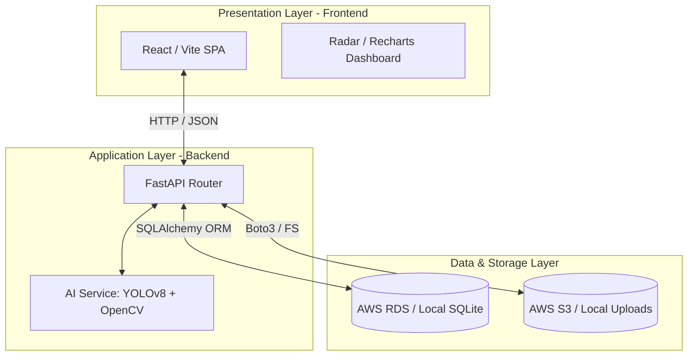
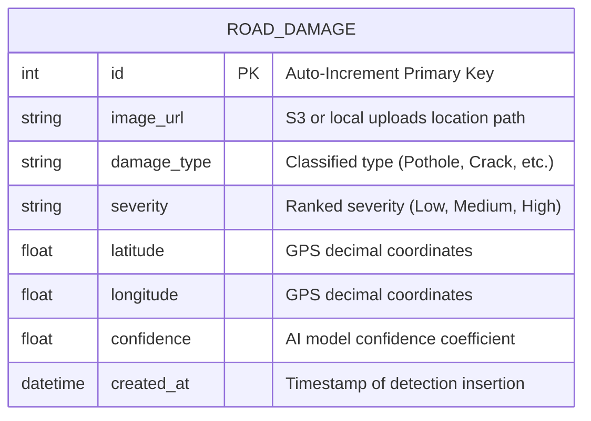
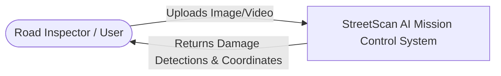
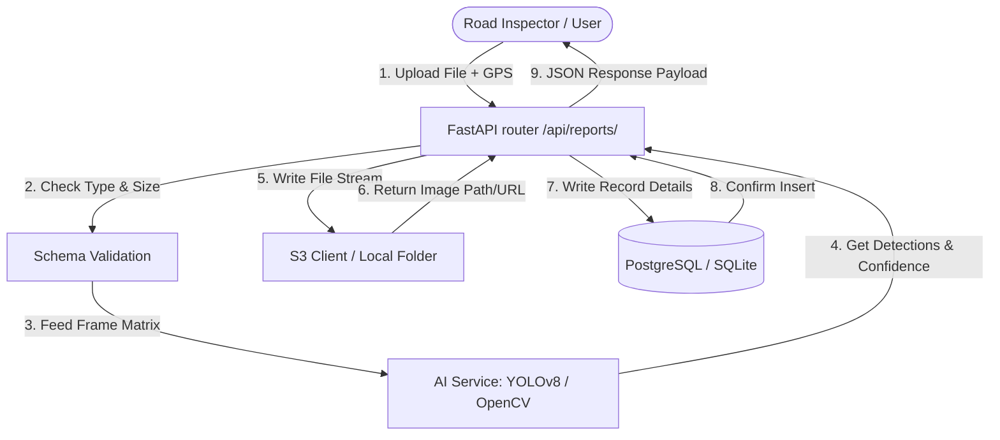
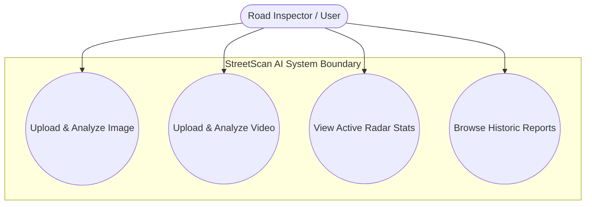
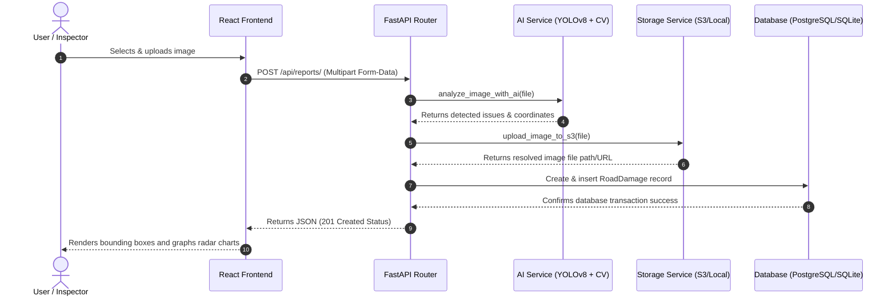
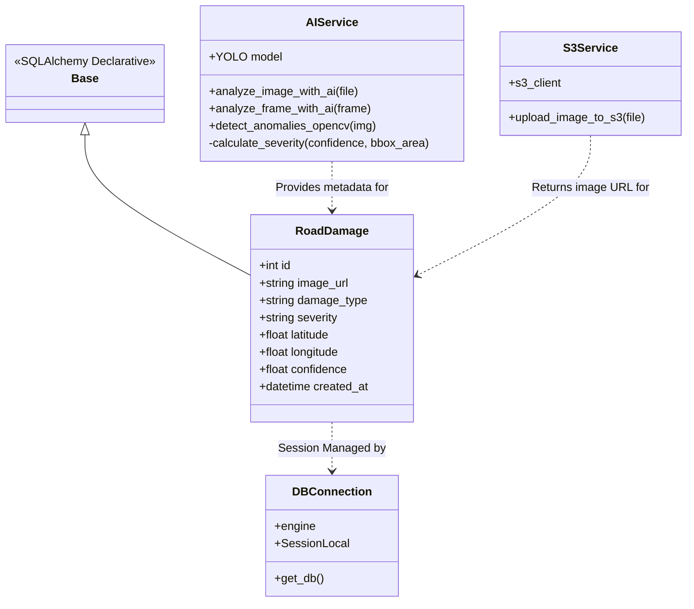
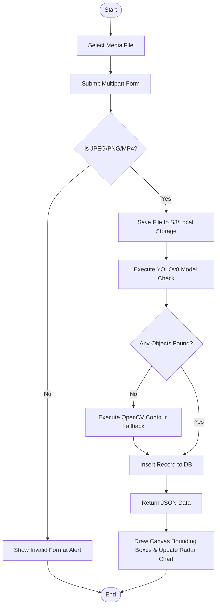

# 4. SYSTEM DESIGN

## 4.1 HIGH LEVEL DESIGN (ARCHITECTURAL)
The **StreetScan AI Mission Control** system follows a classic **Client-Server Architecture** decoupled into a React frontend client and a FastAPI backend server. For maximum deployment flexibility, the design supports both local developer workstations and fully integrated AWS Cloud production environments.

### Architectural Workflow
1. **Presentation Layer:** The Vite + React web interface handles UI layout, interactive dashboards, dynamic charting, and local media selection.
2. **Application (API) Layer:** The FastAPI server exposes REST endpoints to manage uploads, handle file parsing, and orchestrate the AI pipeline.
3. **AI & Computer Vision Service:** A hybrid detection service processes images using **YOLOv8** with an **OpenCV** geometric morphology contour fallback layer.
4. **Data & Storage Layer:** System parameters, detection indexes, and GPS metadata are stored in a database (AWS RDS PostgreSQL or local SQLite). Original media files are written to cloud object storage (AWS S3) or a local static uploads directory.



---

## 4.2 LOW LEVEL DESIGN
The low-level components break down modular duties across routers, schema validation layers, database controllers, and visual components.

```
MajorProject-main/
├── frontend/
│   ├── src/
│   │   ├── components/            # UI widgets (VideoPlayer, Radar, EarthGlobe)
│   │   └── services/              # API and WebSocket client (api.js)
└── backend/
    └── Backend/
        └── road_damage_aws/
            ├── main.py            # API entrypoint, mounts CORS and static files
            ├── database.py        # SQLAlchemy engine & session generation
            ├── models.py          # SQLAlchemy table models
            ├── schemas.py         # Pydantic data schemas for request/response
            ├── routers/           # Endpoint handlers (damage.py)
            └── services/          # Business logic wrappers (ai_service.py, s3_service.py)
```

* **Request Validation:** Requests are validated at boundaries using **Pydantic** models (schemas), ensuring strict validation of float coordinates and media types.
* **ORM Session Injection:** Database sessions are injected into routers dynamically using FastAPI dependency injection (`Depends(get_db)`).

---

## 4.3 ENTITY RELATIONSHIP DIAGRAM
The system maintains a single-entity structural scheme to track detection events, mapping geographic points directly to detection URLs, defect classifications, and severity rankings.



---

## 4.4 DATA FLOW DIAGRAM
The data flow diagrams describe how raw upload binaries are progressively transformed into structured records.

### Level 0 DFD (Context Diagram)


### Level 1 DFD


---

## 4.5 USE CASE DIAGRAM
The primary use cases identify actions available to users interacting with the dashboard interface.



---

## 4.6 SEQUENCE DIAGRAM
This sequence diagram shows the step-by-step transaction flow during a road damage image upload.



---

## 4.7 CLASS DIAGRAM
This diagram shows the main classes, models, and dependencies used within the backend application layer.



---

## 4.8 ACTIVITY DIAGRAM
The activity diagram tracks the workflow logic from client selection to user visualization.



---

## 4.9 TABLE DESIGN

### Table Name: `road_damage`
Stores details of all detected road damages.

| Column Name | Data Type | Constraints | Description |
| :--- | :--- | :--- | :--- |
| `id` | `INTEGER` | `PRIMARY KEY`, `AUTO_INCREMENT` | Unique identifier for the damage record. |
| `image_url` | `VARCHAR` | `NOT NULL` | Path or URL to the uploaded damage image. |
| `damage_type` | `VARCHAR` | `NOT NULL`, `INDEX` | Type of damage detected (e.g. `Pothole`, `Crack`). |
| `severity` | `VARCHAR` | `NOT NULL`, `INDEX` | Severity level of damage (`Low`, `Medium`, `High`). |
| `latitude` | `DOUBLE PRECISION` | `NOT NULL` | Geographic latitude coordinates of detection. |
| `longitude` | `DOUBLE PRECISION` | `NOT NULL` | Geographic longitude coordinates of detection. |
| `confidence` | `DOUBLE PRECISION` | `NOT NULL` | AI model detection confidence percentage (0.0 to 1.0). |
| `created_at` | `TIMESTAMP` | `DEFAULT CURRENT_TIMESTAMP` | The date and time when the entry was created. |

---

## 4.10 INPUT / OUTPUT INTERFACE DESIGN

### Frontend UI Layout
* **Input Interface:**
  * **Media Area:** Drag-and-drop file uploader zone. Supports selecting `.jpg`, `.png`, and `.mp4` video files.
  * **Upload Controls:** "Analyze Image" and "Analyze Video" action triggers.
* **Output Interface:**
  * **Live Box Draw Overlay:** Overlays color-coded bounding boxes directly onto the image/video frames (Red for Potholes, Amber for Cracks).
  * **Radar Integrity Web Chart:** HSL-tailored charts plotting Potholes (D40), Longitudinal Cracks (D00), Transverse Cracks (D10), Alligator Cracks (D20), and Healthy Road Conditions values.
  * **Data Table Logs:** List of all scanned items showing severity badges, confidence logs, and timestamp entries.

### API Specifications
#### 1. Upload & Analyze Image
* **Endpoint:** `POST /api/reports/`
* **Input (Form-Data):**
  * `file`: Binary file (image/jpeg, image/png)
  * `latitude`: Float (e.g., `37.7749`)
  * `longitude`: Float (e.g., `-122.4194`)
* **Output (JSON):**
  ```json
  {
    "id": 1,
    "damage_type": "Pothole",
    "severity": "High",
    "latitude": 37.7749,
    "longitude": -122.4194,
    "confidence": 0.92,
    "image_url": "/uploads/f3c4500f-4814-4534-b310-32bbaa39c8a5.jpg",
    "created_at": "2026-06-06T01:50:46",
    "analysis": {
      "detected_issues": [
        {
          "type": "Pothole",
          "severity": "High",
          "confidence": 0.92,
          "bbox": [20, 20, 40, 40]
        }
      ]
    }
  }
  ```

#### 2. Upload & Process Video
* **Endpoint:** `POST /api/reports/video`
* **Input (Form-Data):**
  * `file`: Binary file (video/mp4, video/avi)
* **Output (JSON):**
  ```json
  {
    "success": true,
    "data": {
      "frames_scanned": 30,
      "damage_frames": 2,
      "worst_severity": "High",
      "peak_confidence": 92,
      "timeline": [
        {
          "frame_index": 30,
          "timestamp": 1.0,
          "detected_issues": [
            {
              "type": "Pothole",
              "severity": "High",
              "confidence": 0.92,
              "bbox": [20, 20, 40, 40]
            }
          ]
        }
      ]
    }
  }
  ```

---

## 4.11 MODULE DESCRIPTION

### Frontend Modules
* **Dashboard Container (`App.jsx`):** Manages global navigation tabs, coordinates coordinates sharing between widgets, and handles real-time map event triggers.
* **Media Frame Controller (`VideoPlayer.jsx`):** Hosts custom canvas wrappers to parse and draw relative bounding boxes on media canvases. Triggers API upload actions.
* **Radar Controller (`DamageRadarChart.jsx`):** Custom Recharts module plotting structural road decay parameters dynamically.
* **Historic Logs (`ManagementDashboard.jsx`):** Fetches, filters, and renders tabular layouts of historic database entries.

### Backend Modules
* **App Bootstrapper (`main.py`):** Configures FastAPI settings, mounts static upload directories, registers routers, and binds global middleware filters.
* **Database Controller (`database.py`):** Configures dialect engines, initializes connection pools, and defines transactional session states.
* **Reports Routing Handler (`routers/damage.py`):** Exposes core business interfaces, validates schema payloads, handles multipart file parsing, and rolls back DB transactions on errors.
* **AI Analysis Wrapper (`services/ai_service.py`):** Initializes local YOLO model weights, maps detection coordinates, and executes classical OpenCV backup filters.
* **S3 / local File Handler (`services/s3_service.py`):** Abstracts file stream writes to secure remote AWS buckets or maps local file paths.
